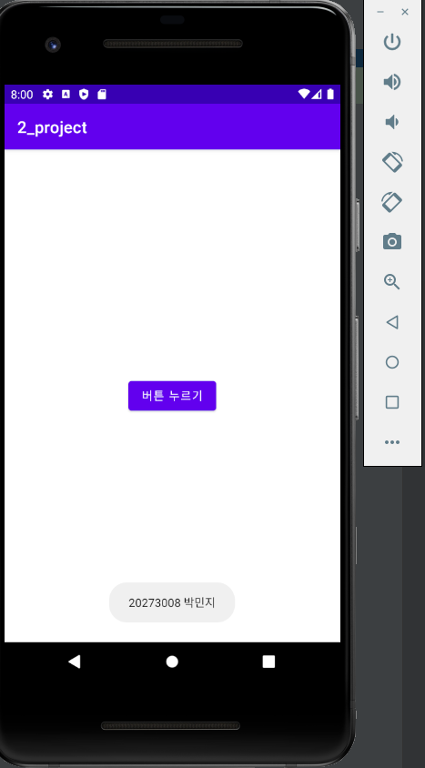
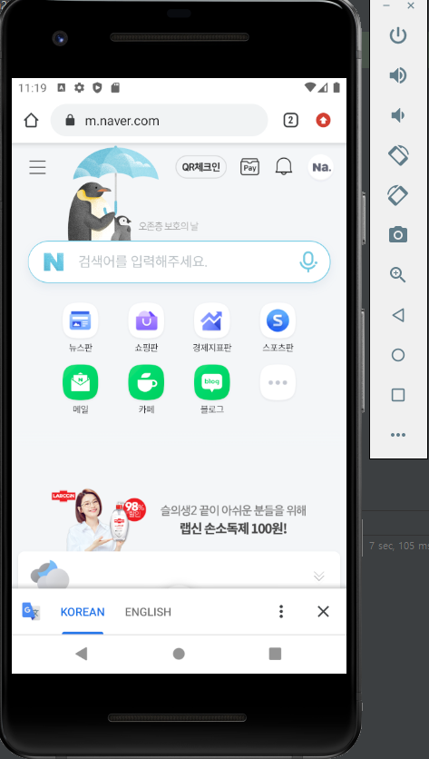
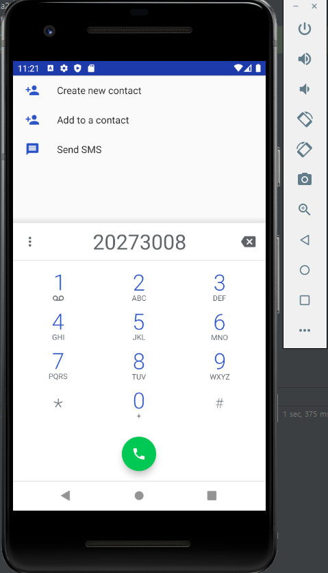

# 20273008 박민지

## 1주차 과제

## 2주차 과제
</img>
</img>

## 3주차 과제
</img>
</img>

## 4주차 과제

    - 아이디어 명 : 게임 추천 서비스 앱
    - 기획 배경 : 최근에는 '추천 알고리즘'을 통해 개인 취향을 분석해 영화나 동영상 등 콘텐츠를 추천해 주는 서비스가 많습니다. 그리고 이용자들은 다양한 추천을 받고 서비스를 이용하게 됩니다.
      그래서 저는 게임을 추천해 주는 앱을 만들어 보고 싶습니다. 취미로 게임을 하는 저로서 게임 추천 앱이 있었으면 좋겠다고 생각했습니다.
      추천 알고리즘을 통해 게임을 추천해 주고 취향 분석하는 앱을 개발해 본다면 게임을 하는 사람들에게 유용할 것 같습니다.
